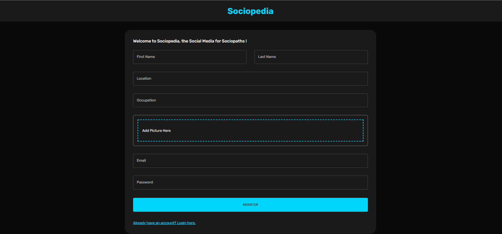
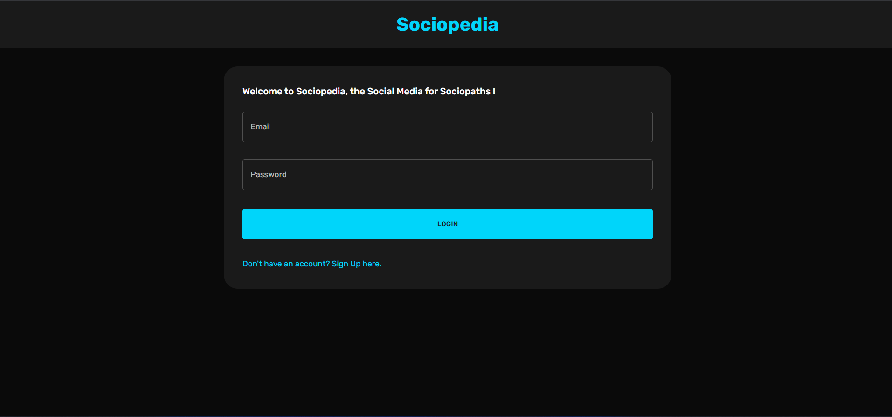
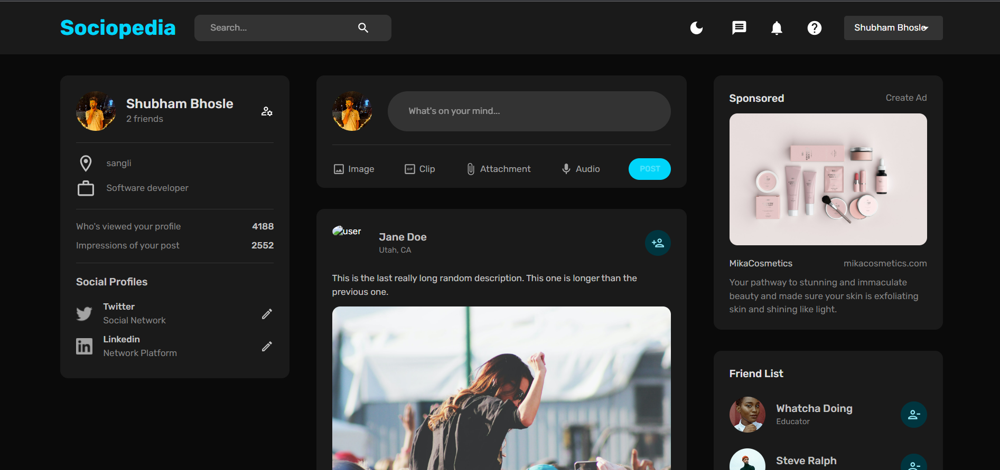
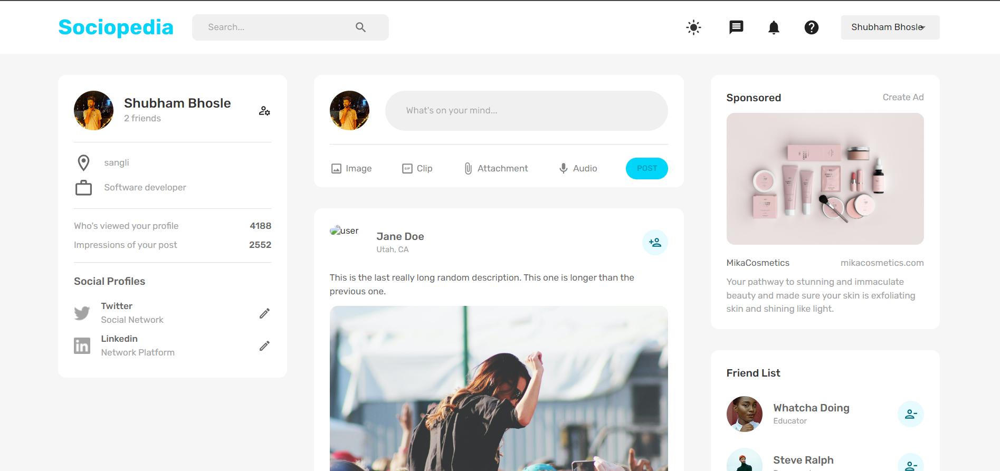
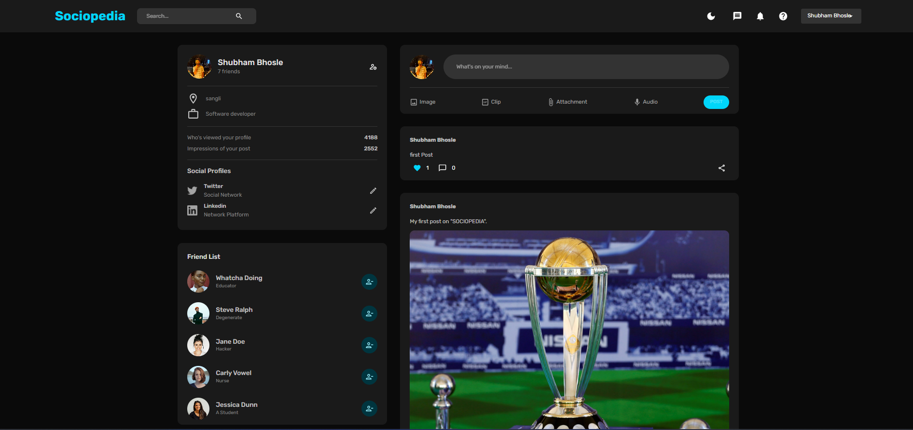
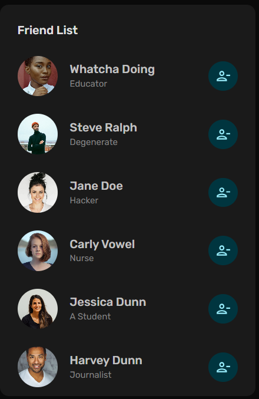
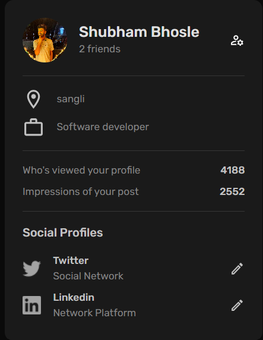

# Sociopedia

- Sociopedia website is a vibrant and dynamic platform designed for users to connect, share, and engage with their friends and acquaintances. It provides a seamless and intuitive experience for individuals to express themselves through pictures and build meaningful connections with others.
  Interactions and Engagement: Users can engage with posts by liking, commenting, and sharing pictures. They can express their appreciation, provide feedback, and initiate discussions through comments. The platform fosters interactions and promotes engagement among users.

---

## Register as User

- The registration process for the social media website is designed to be simple, user-friendly, and secure. Let's register as a user on "sociopedia".

## Login into "SOCIOPEDIA".

The Login page is the gateway to the social media platform, where users can securely access their accounts by entering their registered email address and password. It provides a streamlined interface for quick and convenient authentication, ensuring a seamless user experience

## Home Page

- Here User can see all feed posts by other users.

- Sociopedia provides a versatile user experience by offering both light and dark mode options. This feature allows users to customize the app's appearance based on their preferences and environmental conditions.

## Creating First Post on Sociopedia

- Create a post. Users can create & share their posts using mypost widget.

## User Profile

- The user profile is a central hub that represents an individual's online presence on a social media website. It serves as a personal identity and provides a platform for users to express themselves and connect with others.

  

## FriendList

- Personalized Friend List: Each user has a personalized friend list where they can see a collection of their accepted friend requests or connections. The friend list displays the profile pictures, names, and other relevant information of their friends, providing a quick overview of their social connections.User can easily unfriend a person if he wants.

  

## User Info Widget

- The User Widget is a versatile and informative component on our social media platform that provides users with a comprehensive overview of their profile, social presence, and engagement metrics. It serves as a dashboard of key information, empowering users to understand their online presence and make informed decisions about their social interactions.

## Advertisement Widget

- The Advertisement widget on "SOCIOPEDIA" showcases targeted ads to users, delivering relevant content and promotions that align with their interests. It enhances user engagement and provides advertising opportunities for businesses to reach a wider audience within the social media platform.

## Features

- Connect and Share: Easily connect with friends, family, and colleagues and share your thoughts, photos, and videos in real-time.

- News Feed: Stay updated with a personalized news feed that brings together posts, articles, and media from your network and interests.

- Privacy Controls: Take control of your privacy with customizable settings to choose who can view your profile, posts, and personal information.

- Explore and Discover: Discover new content, communities, and trending topics through exploration features, hashtags, and recommendations.

- Engage and Interact: Like, comment from others, join discussions, and build meaningful connections with people around the world.

## Tech Stack

Frontend:- ReactJS , Material UI
Backend:- MongoDB, expressJS , NodeJS

## Future Scope

- Used to connect people across the globe.

## Authentication

- Login - Registration Page
