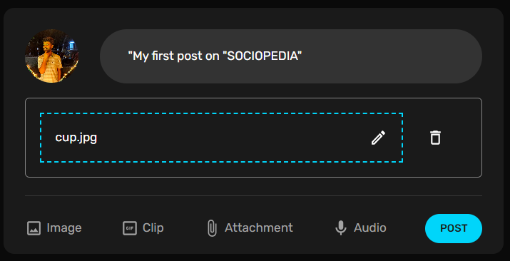

# Sociopedia

    Sociopedia website is a vibrant and dynamic platform designed for users to connect, share, and engage with their friends and acquaintances. It provides a seamless and intuitive experience for individuals to express themselves through pictures and build meaningful connections with others.
    Interactions and Engagement: Users can engage with posts by liking, commenting, and sharing pictures. They can express their appreciation, provide feedback, and initiate discussions through comments. The platform fosters interactions and promotes engagement among users.

---

- Register as User.

- Login into "SOCIOPEDIA".

## Home Page

- Here User can see all feed posts by other users.

- Home Page in Light Mode.

## Creating First Post on Sociopedia

- Create a post. Users can create & share their posts using mypost widget.

## User Profile

- User can see his/her posts on this page. Also he can see his friend list and can remove the existing friends.

  

## FriendList

- Friend List shows current user's friends and can unfriend current friends.

  

## User Info Widget

- User can see his friends, like counts , who viewed his/her profile numbers.

<!--  -->

## Features

- Authentication using email
- User can share photos, write texts in post
- User can connect with his/her friends on this app
- Advertisements can also be rendered on this app

## Tech Stack

Frontend:- ReactJS , Material UI
Backend:- MongoDB, expressJS , NodeJS

## Future Scope

- Used to connect people across the globe.

## Authentication

- Login - Registration Page
